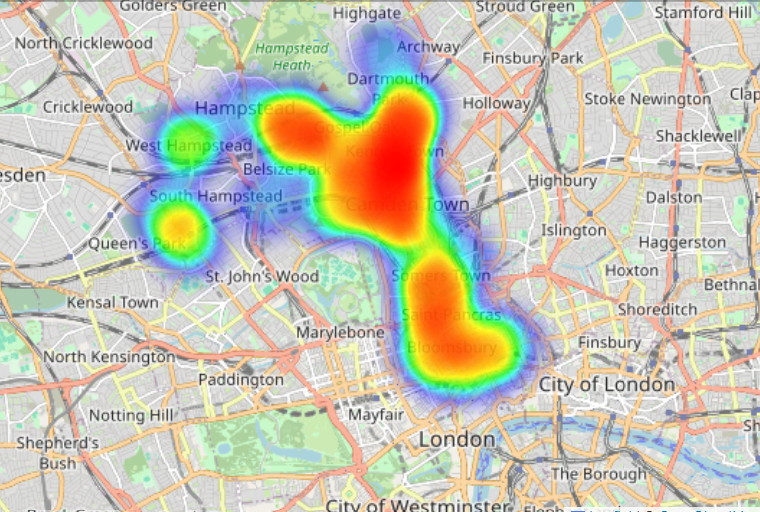
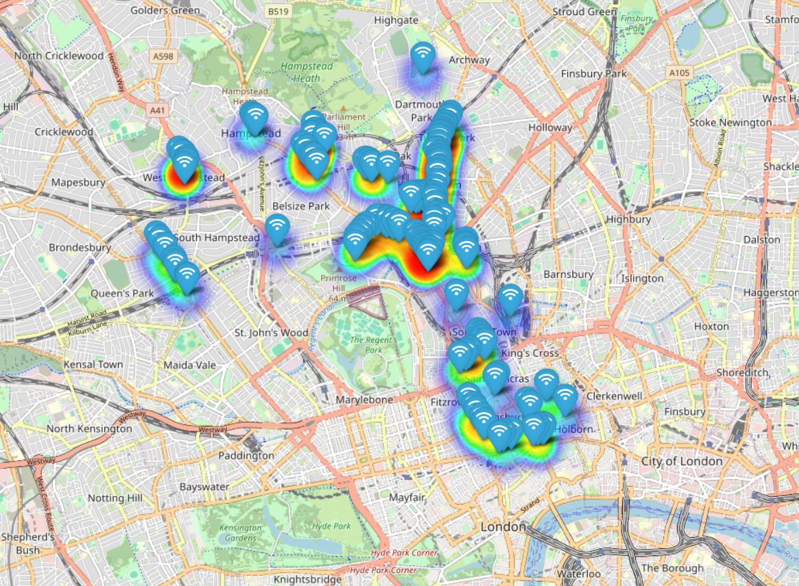

# Camden-Public-WiFi-Network

Create an interactive visualization showcasing the distribution and coverage of public Wi-Fi hotspots in Camden using the public dataset. 

Create an Accessibility Heatmap, a Histogram of Coverage Ranges, and Key Insights such as the average, maximum, and minimum coverage ranges, as well as the road with the highest coverage.

## Contents
- [Accessibility Heatmap](#accessibility-heatmap)
- [Camden Public WiFi Network](#camden-public-wifi-network)
- [What You'll Learn](#what-youll-learn)
- [Getting Started](#getting-started)

## Accessibility Heatmap

## Interactive Camden Public WiFi Network Map

## What You'll Learn

- Using Geospatial data 
- Visualizing spatial data points and heatmap with folium
- Perform Analysis on spatial data

## Getting Started

1. Clone the repository

Run the following command in local directory using terminal 
`git clone https://github.com/daameya/Camden-Public-WiFi-Network.git'

2. Navigate to project

cd Camden-Public-WiFi-Network

3. Open Vscode

when in the project directory run
'code .'

4. Install libraries from requirements.txt

pip install -r requirements.txt

5. Run Jupyter notebook research.ipynb

## [Back Up](#Camden-Public-WiFi-Network)
